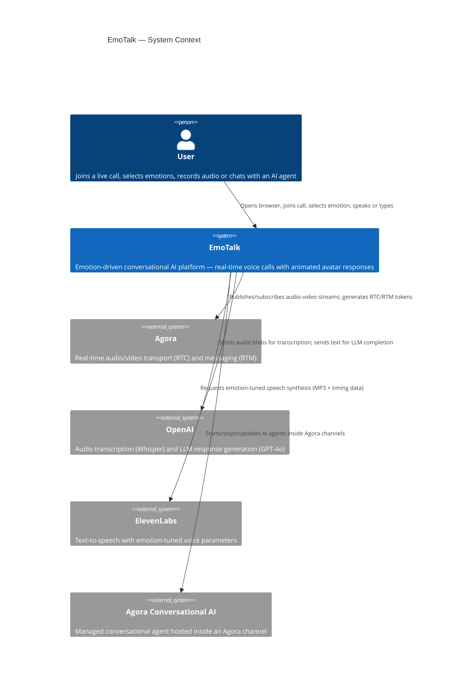
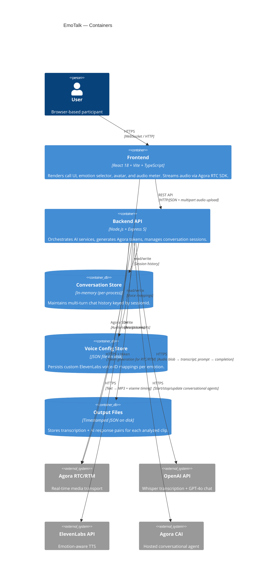
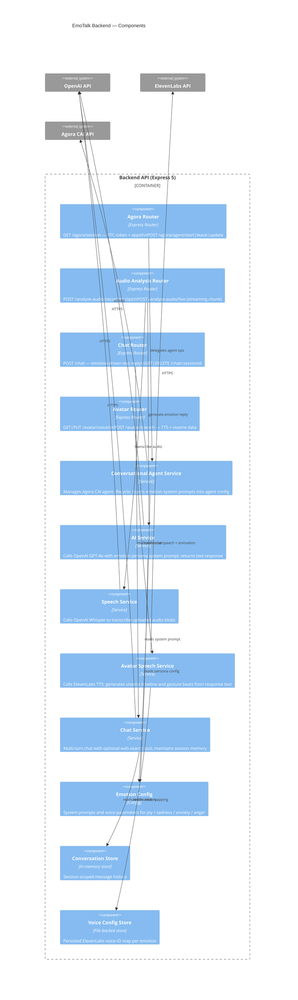
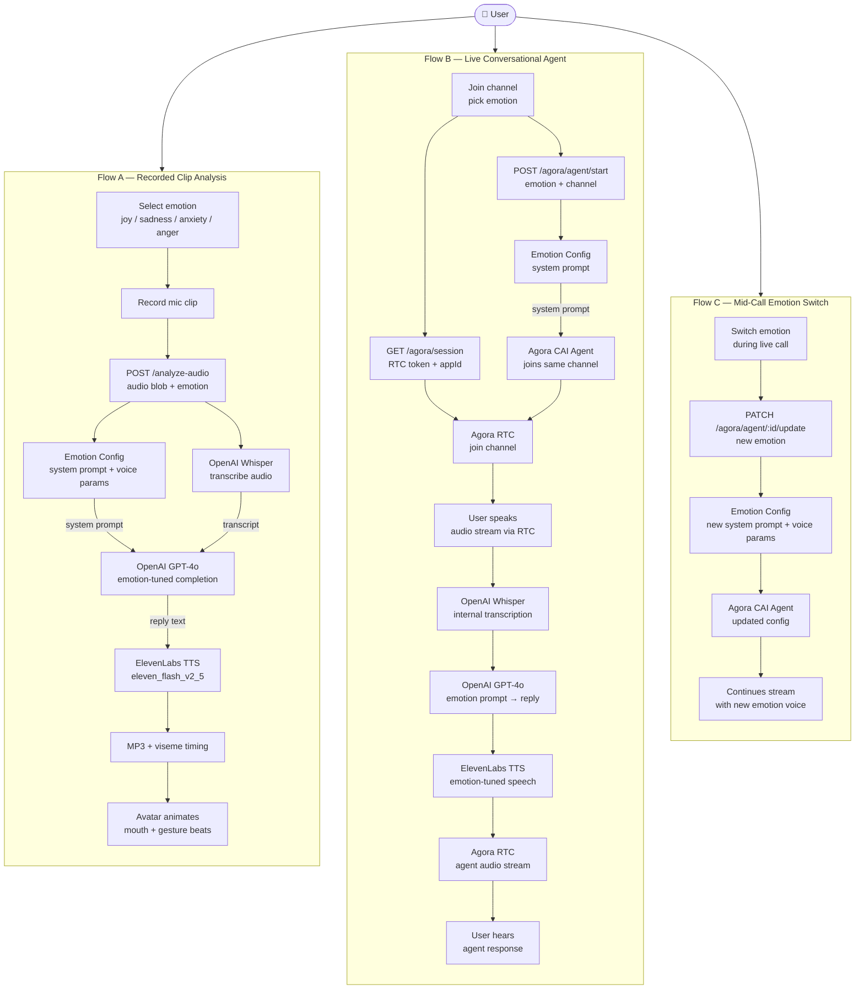

# EmoTalk

**Emotion-driven conversational AI platform** for real-time voice and video communication. Users select emotional personas (joy, sadness, anxiety, anger) that shape how an AI agent speaks, responds, and animates an avatar in live calls.

---

## System Architecture

### C4 Level 1 — System Context



---

### C4 Level 2 — Container Diagram



---

### C4 Level 3 — Backend Component Diagram



---

## Project Structure

```
emotalk/
├── apps/
│   ├── frontend/          # React + Vite SPA
│   │   └── src/
│   │       ├── App.tsx                  # Root component & state machine
│   │       ├── components/
│   │       │   ├── EmotionAvatar.tsx    # Viseme-driven animated avatar
│   │       │   ├── CallSetupPanel.tsx   # Channel join / role selection
│   │       │   ├── LiveResponsePanel.tsx
│   │       │   └── AudioMeterCard.tsx
│   │       ├── hooks/                   # Custom React hooks
│   │       ├── lib/
│   │       │   ├── api.ts               # Typed API client
│   │       │   ├── emotions.ts          # Emotion type definitions
│   │       │   └── conversational-ai-api/  # Agora CAI SDK wrapper
│   │       └── store/                   # Client-side state
│   └── backend/           # Express 5 API
│       └── src/
│           ├── app.js                   # Express setup & middleware
│           ├── config/
│           │   └── emotions.js          # System prompts + voice settings
│           ├── controllers/
│           ├── routes/
│           ├── services/                # Core business logic
│           │   ├── conversationalAgentService.js
│           │   ├── avatarSpeechService.js
│           │   ├── chatService.js
│           │   ├── aiService.js
│           │   └── speechService.js
│           └── utils/
└── packages/
    └── shared/            # Cross-cutting types & utilities
```

---

## Key User Flows

### 1. Recorded Clip Analysis
```
User records mic clip → POST /analyze-audio →
  Whisper transcription → GPT-4o emotion reply →
  ElevenLabs TTS + viseme timeline →
  Avatar animates mouth + gesture beats
```

### 2. Live Conversational Agent (Agora CAI)
```
User joins channel → POST /agora/agent/start (emotion) →
  Agora CAI agent joins channel with emotion system prompt →
  Agent listens, transcribes, generates, speaks in real-time →
  PATCH /agora/agent/:id/update to change emotion mid-call
```

### 3. Text Chat
```
POST /chat { message, emotion, sessionId } →
  GPT-4o with emotion persona (± web search tool) →
  Response returned; session history maintained in-memory
```

---

## Emotions

| Emotion | Personality | Voice | Visual |
|---------|-------------|-------|--------|
| **Joy** | Energetic, optimistic, high-hype | Fast (1.08×), high style (0.82) | Pink→purple gradient, animated canvas |
| **Sadness** | Slow, empathetic, non-judgmental | Slow (0.92×), low style (0.28) | Cool blues, soft imagery |
| **Anxiety** | Alert, risk-aware, fast-thinking | Rapid (1.02×), high stability (0.40) | Cyan→blue, restless motion |
| **Anger** | Sharp, intense, action-focused | Punchy (1.05×), very low stability (0.22) | Red→orange heat gradient |

---

## Tech Stack

| Layer | Technology |
|-------|------------|
| Frontend | React 18, TypeScript, Vite |
| Real-time media | Agora RTC SDK v4, Agora RTM v2 |
| Backend | Node.js, Express 5 |
| LLM | OpenAI GPT-4o |
| Transcription | OpenAI Whisper (`gpt-4o-mini-transcribe`) |
| TTS | ElevenLabs (`eleven_flash_v2_5`) |
| Conversational AI | Agora Conversational AI (CAI) |

---

## Getting Started

### Prerequisites

- Node.js 20+
- API keys: OpenAI, ElevenLabs, Agora (App ID + Certificate + CAI credentials)

### Setup

```bash
# Install all workspaces
npm install

# Copy and fill in environment variables
cp .env.example .env
```

Required `.env` values:

```env
PORT=3000
CORS_ORIGIN=http://localhost:5173

OPENAI_API_KEY=
AGORA_APP_ID=
AGORA_APP_CERTIFICATE=
ELEVENLABS_API_KEY=

# Optional: per-emotion ElevenLabs voice IDs
ELEVENLABS_VOICE_ID_JOY=
ELEVENLABS_VOICE_ID_SADNESS=
ELEVENLABS_VOICE_ID_ANXIETY=
ELEVENLABS_VOICE_ID_ANGER=

# Agora Conversational AI (required for live agent mode)
AGORA_CAI_CUSTOMER_ID=
AGORA_CAI_CUSTOMER_SECRET=
AGORA_CAI_BASE_URL=
```

### Run

```bash
# Start both frontend and backend in dev mode
npm run dev

# Or individually
npm run dev --workspace=apps/frontend
npm run dev --workspace=apps/backend
```

Frontend: http://localhost:5173
Backend: http://localhost:3000

---

## API Reference

| Method | Path | Description |
|--------|------|-------------|
| `GET` | `/agora/session` | Get RTC session token + appId |
| `POST` | `/agora/agent/start` | Start live AI agent in channel |
| `PATCH` | `/agora/agent/:id/update` | Change agent emotion mid-call |
| `POST` | `/agora/agent/:id/leave` | Stop agent |
| `POST` | `/analyze-audio` | Transcribe + respond to recorded clip |
| `POST` | `/analyze-audio/live` | Process live audio chunk (no persistence) |
| `POST` | `/chat` | Emotion-driven text chat |
| `GET` | `/chat/:sessionId` | Retrieve session history |
| `DELETE` | `/chat/:sessionId` | Clear session |
| `POST` | `/avatar/speech` | Generate TTS + viseme/gesture data |
| `GET` | `/avatar/voices` | List available voice mappings |
| `PUT` | `/avatar/voices` | Save custom voice mapping |
| `GET` | `/health` | Health check |

---

## Workspace Commands

```bash
npm run dev      # Start all apps in development mode
npm run build    # Build all apps
npm run test     # Run tests across all workspaces
npm run lint     # Lint all workspaces
```

## End-to-End Data Flow



---

## Conventions

- Keep application-specific code inside its app directory (`apps/frontend`, `apps/backend`).
- Move reusable code into `packages/shared` instead of duplicating it.
- Emotion system prompts and voice parameters live in `apps/backend/src/config/emotions.js` — change personalities there, not in service code.
